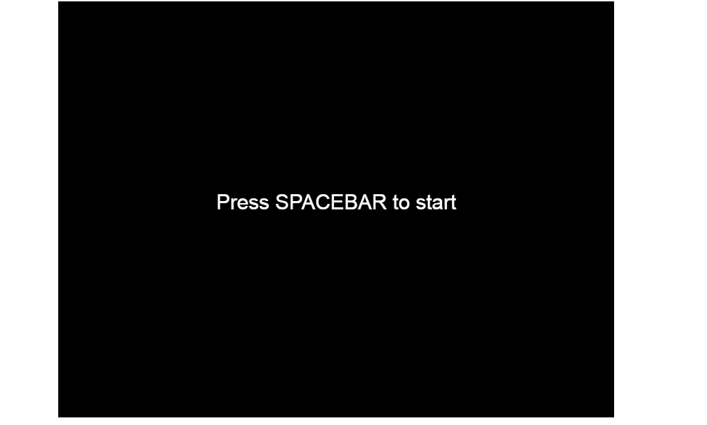
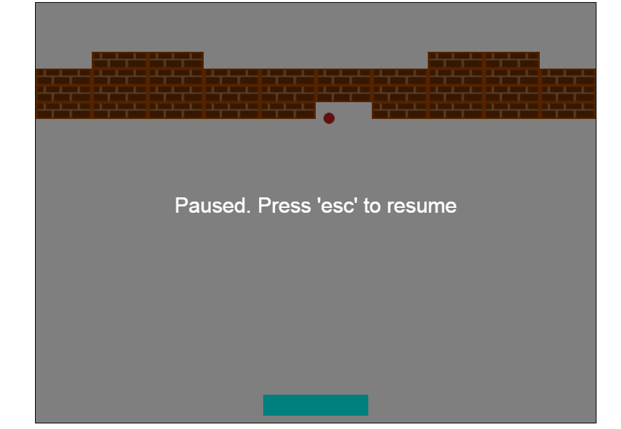
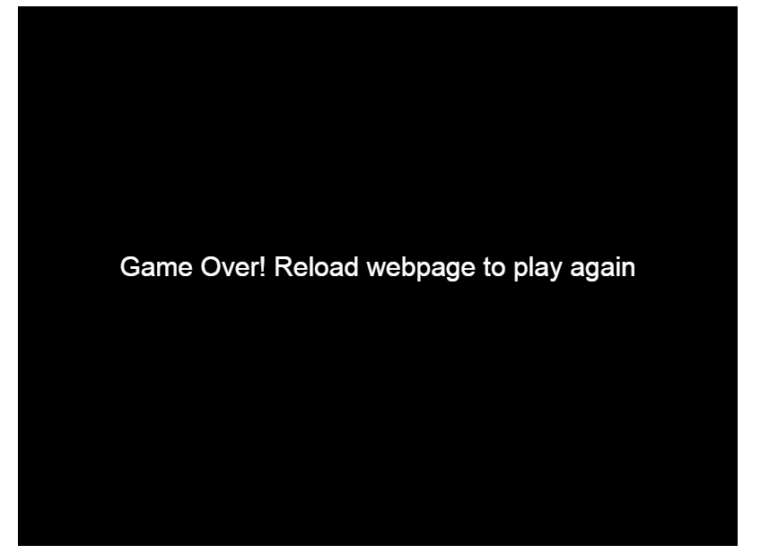

# BreakOut
simple breakout game using HTML5 canvas and Vanilla JavaScript
# Instructions:
Ensure that all the files (images, html and javascript) are in the same folder/directory.
Then proceed to open index.html fileusing your preferred browser. The following screen will appear.

Press space bar to play.
Use 'Esc' key to pause game.

The player has three lives, after which the game over screen below is displayed.

